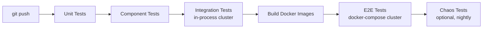
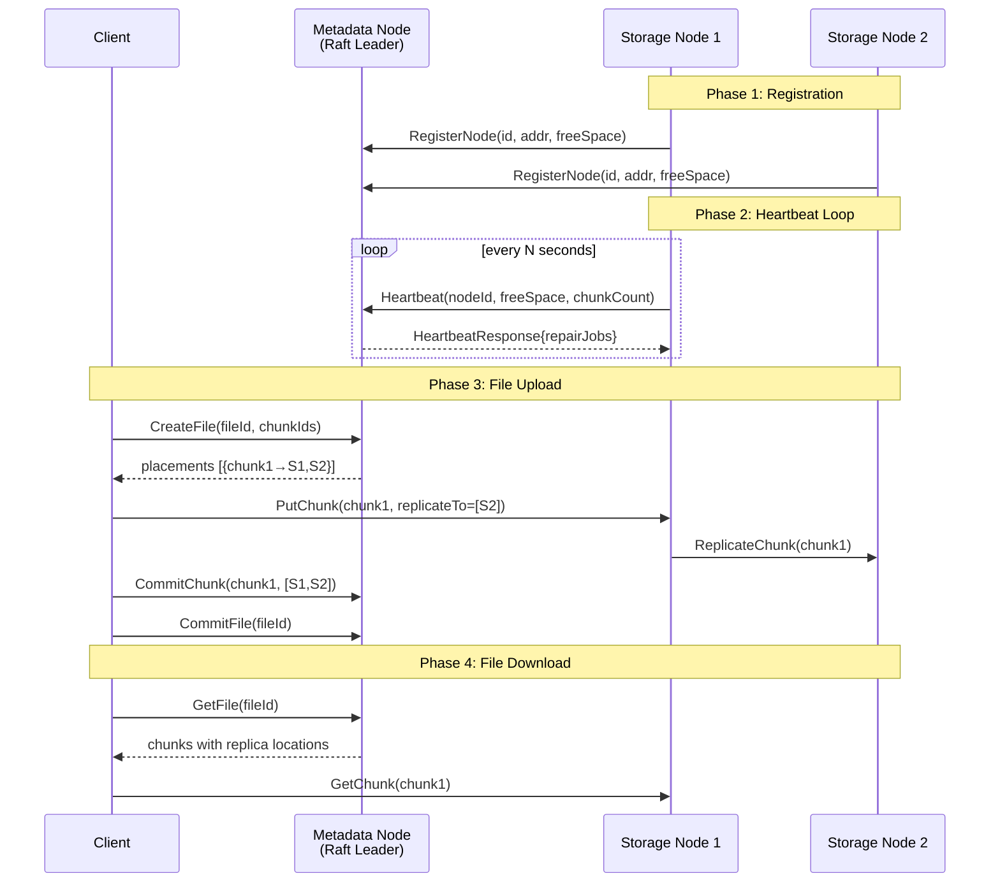

# Integration Testing for Distributed Systems — Industry Patterns & Your DFS

## 1. Industry Standard: The Testing Pyramid for Distributed Systems

In production distributed systems (HDFS, CockroachDB, etcd, Ceph, etc.), testing is organized in layers:

```
                    ┌─────────────────┐
                    │   E2E / Chaos   │  ← Prod-like cluster, fault injection
                    ├─────────────────┤
                 ┌──┤  Integration    │  ← Real processes, real gRPC, real Raft
                 │  ├─────────────────┤
                 │  │   Component     │  ← One node + mock dependencies
                 │  ├─────────────────┤
                 │  │   Unit Tests    │  ← Pure logic, in-memory, fast
                 └──┴─────────────────┘
```

### What You Already Have (✅)
- **Unit tests**: FSM logic, store operations, handler tests with mocks, Raft bootstrap tests
- **Component tests**: `StorageNode` start/stop, Raft leader election

### What's Missing (❌)
- **Integration tests**: Metadata node + Storage node(s) talking over real gRPC
- **E2E tests**: Full client → metadata → storage upload/download cycle

---

## 2. How Industry Does Integration Testing

### 2a. In-Process Test Harness (Most Common for Go)

> Used by: **etcd, CockroachDB, HashiCorp Consul/Nomad, Vitess**

Spin up real node instances inside `go test` using `TestMain` or test helpers. No Docker, no external processes. Each test gets an isolated mini-cluster.

**Why this is the gold standard for Go:**
- Your code already supports this — both `MetadataNode` and `StorageNode` are constructable with configs that take `":0"` (OS-assigned ports)
- Tests run in CI without Docker-in-Docker
- Deterministic: no race with port binding or container startup
- Fast: no image pull, no container overhead
- You can inject faults programmatically (kill a node, partition, corrupt data)

```
┌─────────────────── go test ───────────────────┐
│                                               │
│  TestMain() {                                 │
│    metadataNode = NewMetadataNode(cfg)        │
│    metadataNode.Start()                       │
│                                               │
│    storageNode1 = NewStorageNode(cfg1)        │
│    storageNode1.Start()                       │
│                                               │
│    storageNode2 = NewStorageNode(cfg2)        │
│    storageNode2.Start()                       │
│                                               │
│    // → run tests against real gRPC endpoints │
│    // → teardown in reverse order             │
│  }                                            │
└───────────────────────────────────────────────┘
```

### 2b. Docker Compose / Testcontainers (For Heavier Systems)

> Used by: **Kafka, Cassandra, large Java/Python ecosystems**

When components can't easily be instantiated in-process (JVM services, Python services, third-party deps), you use containers:

- **Docker Compose**: define a `docker-compose.test.yml` with metadata + N storage nodes, run tests against it
- **Testcontainers** (Go: `testcontainers-go`): programmatically start containers from tests

**For your Go project, this is overkill** — you can do everything in-process. Docker Compose is better suited for your _deployment_ testing and the visualizer/dashboard you discussed earlier.

### 2c. CI Pipeline Design



### 2d. Chaos / Fault Injection (Advanced)

> Used by: **Netflix Chaos Monkey, Jepsen, LitmusChaos**

After integration tests pass, fault-injection tests verify the system handles:
- Node crashes mid-operation
- Network partitions (Raft split-brain)
- Disk corruption
- Clock skew

For your system, this means: kill a storage node mid-upload and verify the repair scheduler fills the gap.

---

## 3. Your DFS Integration Surface

Based on the codebase, these are the critical cross-node interactions to test:



### Key Integration Scenarios

| # | Scenario | What it validates |
|---|----------|-------------------|
| 1 | **RegisterNode → Heartbeat** | Storage node appears in FSM, watcher tracks it, heartbeats update last-seen |
| 2 | **CreateFile → PutChunk → CommitChunk → GetFile → GetChunk** | Full upload+download round-trip across metadata & storage |
| 3 | **Heartbeat carries repair jobs** | After under-replication, heartbeat response includes `RepairInstruction` |
| 4 | **Node death → repair triggered** | Stop a storage node, watcher marks it suspect/dead, repair scheduler creates jobs |

---

## 4. Concrete Implementation Plan

### 4a. Project Structure

```
integration/                          # new top-level package
├── integration_test.go               # TestMain + cluster lifecycle
├── registration_test.go              # Scenario 1
├── upload_download_test.go           # Scenario 2
├── repair_test.go                    # Scenarios 3 & 4
└── helpers.go                        # shared utilities
```

> [!IMPORTANT]
> Use a **separate `integration` package** (not inside `metadata` or `storage`) so the tests depend on both packages' public APIs, exactly like a real client would.

### 4b. Test Harness Skeleton

```go
// integration/integration_test.go
package integration

import (
    "context"
    "fmt"
    "os"
    "testing"
    "time"

    "github.com/satyam709/distributed-fs/internal/logging"
    "github.com/satyam709/distributed-fs/metadata"
    "github.com/satyam709/distributed-fs/storage"
    "github.com/satyam709/distributed-fs/storage/store"

    pb_meta "github.com/satyam709/distributed-fs/gen/proto/metadata/v1"
    pb_storage "github.com/satyam709/distributed-fs/gen/proto/storage/v1"
    "google.golang.org/grpc"
    "google.golang.org/grpc/credentials/insecure"
)

// cluster holds a running mini-cluster for integration tests.
type cluster struct {
    metaNode     *metadata.MetadataNode
    metaAddr     string
    storageNodes []*storage.StorageNode
    storageAddrs []string

    metaConn    *grpc.ClientConn
    metaClient  pb_meta.MetadataServiceClient
    storeConns  []*grpc.ClientConn
    storeClients []pb_storage.StorageServiceClient
}

var testCluster *cluster

func TestMain(m *testing.M) {
    var err error
    testCluster, err = startCluster(2) // 1 metadata + 2 storage
    if err != nil {
        fmt.Fprintf(os.Stderr, "cluster start failed: %v\n", err)
        os.Exit(1)
    }

    code := m.Run()

    testCluster.shutdown()
    os.Exit(code)
}

func startCluster(numStorage int) (*cluster, error) {
    c := &cluster{}

    // --- Metadata Node ---
    raftDir, _ := os.MkdirTemp("", "integration-raft-*")
    metaCfg := metadata.NodeConfig{
        NodeID:            "meta-1",
        GRPCAddr:          "127.0.0.1:0",  // OS picks port
        RaftAddr:          "127.0.0.1:0",
        RaftDir:           raftDir,
        Bootstrap:         true,
        ReplicationFactor: numStorage,
        SuspectTimeout:    3 * time.Second,
        DeadTimeout:       6 * time.Second,
        WatcherInterval:   1 * time.Second,
        ReconcileDelay:    2 * time.Second,
        HeartbeatTimeout:  500 * time.Millisecond,
        ElectionTimeout:   500 * time.Millisecond,
        SnapshotInterval:  30 * time.Second,
        SnapshotThreshold: 8192,
        SnapshotRetain:    1,
    }

    c.metaNode, _ = metadata.NewMetadataNode(metaCfg)
    ctx := context.Background()
    if err := c.metaNode.Start(ctx); err != nil {
        return nil, fmt.Errorf("metadata start: %w", err)
    }
    // Grab the actual bound address from the listener
    // (you'll need to expose this — see section 4c)
    c.metaAddr = c.metaNode.BoundGRPCAddr()

    // --- Storage Nodes ---
    logger := logging.NewCLogger()
    for i := 0; i < numStorage; i++ {
        dir, _ := os.MkdirTemp("", fmt.Sprintf("integration-storage-%d-*", i))

        cs, _ := store.NewChecksumIndexBoltDB[[]byte](store.ByteCodec{},
            store.WithDbPath[[]byte](dir))
        cs.Open()

        ds, _ := store.NewDiskStore(
            store.WithChecksumStore(cs),
            store.WithRootDir(dir),
            store.WithTempDir(dir),
        )

        node, _ := storage.NewStorageNode(
            storage.StorageNodeConfig{Port: ":0", Timeout: 30 * time.Second},
            logger,
            ds,
        )
        node.Start()

        c.storageNodes = append(c.storageNodes, node)
        c.storageAddrs = append(c.storageAddrs, node.BoundAddr()) // also needs exposing
    }

    // --- gRPC Clients ---
    opts := grpc.WithTransportCredentials(insecure.NewCredentials())

    c.metaConn, _ = grpc.Dial(c.metaAddr, opts)
    c.metaClient = pb_meta.NewMetadataServiceClient(c.metaConn)

    for _, addr := range c.storageAddrs {
        conn, _ := grpc.Dial(addr, opts)
        c.storeConns = append(c.storeConns, conn)
        c.storeClients = append(c.storeClients, pb_storage.NewStorageServiceClient(conn))
    }

    return c, nil
}

func (c *cluster) shutdown() {
    for _, conn := range c.storeConns {
        conn.Close()
    }
    c.metaConn.Close()
    for _, n := range c.storageNodes {
        n.Stop()
    }
    c.metaNode.Shutdown(context.Background())
}
```

### 4c. Small Code Changes Needed

To make the above work, you need to expose the **actual bound address** from each node (since you're using `":0"`):

#### [metadata/node.go](file:///home/satyam/distributed-fs/DFS/metadata/node.go)
```go
// BoundGRPCAddr returns the actual address the gRPC server is listening on.
// Only valid after Start() returns.
func (mn *MetadataNode) BoundGRPCAddr() string {
    if mn.grpcLis == nil {
        return ""
    }
    return mn.grpcLis.Addr().String()
}
```

#### [storage/node.go](file:///home/satyam/distributed-fs/DFS/storage/node.go)
```go
// You need to save the listener and expose its address:

type StorageNode struct {
    // ... existing fields ...
    grpcLis net.Listener  // add this field
}

// In Start(), save the listener:
// s.grpcLis = listener  (already bound as `listener`)

// BoundAddr returns the actual address the node is listening on.
func (s *StorageNode) BoundAddr() string {
    if s.grpcLis == nil {
        return ""
    }
    return s.grpcLis.Addr().String()
}
```

### 4d. Example Test Scenarios

#### Scenario 1: Registration + Heartbeat Smoke Test

```go
// integration/registration_test.go
func TestStorageNodeRegistration(t *testing.T) {
    ctx, cancel := context.WithTimeout(context.Background(), 10*time.Second)
    defer cancel()

    // Register storage node 1 with metadata
    resp, err := testCluster.metaClient.RegisterNode(ctx, &pb_meta.RegisterNodeRequest{
        NodeId:    "storage-1",
        Address:   testCluster.storageAddrs[0],
        FreeSpace: 1024 * 1024 * 100, // 100 MB
        ChunkIds:  []string{},
    })
    require.NoError(t, err)
    assert.Equal(t, "storage-1", resp.NodeId)

    // Send a heartbeat and verify it succeeds
    hbResp, err := testCluster.metaClient.Heartbeat(ctx, &pb_meta.HeartbeatRequest{
        NodeId:     "storage-1",
        FreeSpace:  1024 * 1024 * 99,
        ChunkCount: 0,
    })
    require.NoError(t, err)
    assert.Empty(t, hbResp.RepairJobs) // no repairs needed yet
}
```

#### Scenario 2: Full Upload → Download Round-Trip

```go
// integration/upload_download_test.go
func TestUploadAndDownload(t *testing.T) {
    ctx, cancel := context.WithTimeout(context.Background(), 30*time.Second)
    defer cancel()

    // 1. Register both storage nodes
    for i, addr := range testCluster.storageAddrs {
        nodeID := fmt.Sprintf("sn-%d", i)
        _, err := testCluster.metaClient.RegisterNode(ctx, &pb_meta.RegisterNodeRequest{
            NodeId:    nodeID,
            Address:   addr,
            FreeSpace: 1 << 30,
        })
        require.NoError(t, err)
    }

    // 2. CreateFile → get placements
    fileID := "test-file-1"
    chunkID := "chunk-001"
    createResp, err := testCluster.metaClient.CreateFile(ctx, &pb_meta.CreateFileRequest{
        FileId:   fileID,
        FileName: "hello.txt",
        FileSize: 1024,
        ChunkIds: []string{chunkID},
    })
    require.NoError(t, err)
    require.Len(t, createResp.Placements, 1)

    primary := createResp.Placements[0].Primary
    t.Logf("primary placement: %s @ %s", primary.NodeId, primary.Address)

    // 3. PutChunk to the primary storage node
    // Connect to the assigned primary
    conn, _ := grpc.Dial(primary.Address,
        grpc.WithTransportCredentials(insecure.NewCredentials()))
    defer conn.Close()
    storageClient := pb_storage.NewStorageServiceClient(conn)

    data := []byte("hello distributed world!")
    checksum := sha256.Sum256(data)

    stream, err := storageClient.PutChunk(ctx)
    require.NoError(t, err)

    err = stream.Send(&pb_storage.PutChunkRequest{
        ChunkId:  chunkID,
        FileId:   fileID,
        Data:     data,
        Checksum: checksum[:],
        IsLast:   true,
    })
    require.NoError(t, err)

    putResp, err := stream.CloseAndRecv()
    require.NoError(t, err)
    assert.Equal(t, int32(200), putResp.Response.Code)

    // 4. CommitChunk
    _, err = testCluster.metaClient.CommitChunk(ctx, &pb_meta.CommitChunkRequest{
        ChunkId:        chunkID,
        FileId:         fileID,
        ConfirmedNodes: []string{primary.NodeId},
        Checksum:       checksum[:],
    })
    require.NoError(t, err)

    // 5. CommitFile
    _, err = testCluster.metaClient.CommitFile(ctx, &pb_meta.CommitFileRequest{
        FileId:   fileID,
        FileSize: int64(len(data)),
        Checksum: checksum[:],
    })
    require.NoError(t, err)

    // 6. GetFile → verify metadata
    getResp, err := testCluster.metaClient.GetFile(ctx, &pb_meta.GetFileRequest{
        FileId: fileID,
    })
    require.NoError(t, err)
    assert.Equal(t, "complete", getResp.File.Status)
    assert.Len(t, getResp.Chunks, 1)

    // 7. GetChunk → verify data round-trip
    getStream, err := storageClient.GetChunk(ctx, &pb_storage.GetChunkRequest{
        ChunkId: chunkID,
    })
    require.NoError(t, err)

    var received []byte
    for {
        frame, err := getStream.Recv()
        if err != nil {
            break
        }
        received = append(received, frame.Data...)
        if frame.IsLast {
            break
        }
    }
    assert.Equal(t, data, received)
}
```

#### Scenario 3: Node Failure → Repair Detection

```go
// integration/repair_test.go
func TestNodeFailureTriggersRepair(t *testing.T) {
    // (after upload with replication factor 2)
    
    // 1. Stop storage node 1
    testCluster.storageNodes[0].Stop()

    // 2. Wait for watcher to detect the death (SuspectTimeout + WatcherInterval)
    time.Sleep(5 * time.Second)

    // 3. Heartbeat from surviving node should carry repair instructions
    ctx := context.Background()
    hbResp, err := testCluster.metaClient.Heartbeat(ctx, &pb_meta.HeartbeatRequest{
        NodeId:     "sn-1",
        FreeSpace:  1 << 30,
        ChunkCount: 1,
    })
    require.NoError(t, err)

    // The repair scheduler should have queued a job for the lost chunk
    assert.NotEmpty(t, hbResp.RepairJobs, "expected repair jobs after node failure")
    t.Logf("repair jobs: %+v", hbResp.RepairJobs)
}
```

---

## 5. Running Integration Tests

### Build Tag Isolation

Use a build tag so integration tests don't run during `go test ./...`:

```go
//go:build integration

package integration
```

Then run:
```bash
# Unit tests only (fast, CI default)
go test ./...

# Integration tests
go test -tags integration -count=1 -timeout 120s ./integration/

# Everything
go test -tags integration -count=1 -timeout 120s ./...
```

### Makefile Addition

```makefile
test-integration:
	go test -tags integration -count=1 -timeout 120s -v ./integration/
```

---

## 6. Summary: What to Do

| Phase | What | Effort |
|-------|------|--------|
| **Phase 1** | Add `BoundGRPCAddr()` / `BoundAddr()` to metadata & storage nodes | ~10 min |
| **Phase 2** | Create `integration/` package with `TestMain` cluster harness | ~1 hour |
| **Phase 3** | Write Scenario 1 (register + heartbeat) & Scenario 2 (upload/download) | ~2 hours |
| **Phase 4** | Write Scenario 3 (repair) & fault injection tests | ~2 hours |
| **Phase 5** | Add `test-integration` to Makefile and CI | ~15 min |

> [!TIP]
> **Start with Phase 1 + 2 + the registration smoke test.** Once that cluster boots and you see `RegisterNode` succeed over real gRPC, everything else is incremental. The harness is the hard part — individual tests are just gRPC client calls.

> [!NOTE]
> **Why not Docker Compose for this?** Your nodes are pure Go with no external dependencies (no Kafka, no Postgres). In-process testing is strictly superior here — faster, more deterministic, easier to debug, and runs in any CI without Docker. Save Docker Compose for deployment smoke tests and the cluster visualizer.

## Open Questions

1. **Storage → Metadata link**: I notice the storage node currently has no reference to the metadata address. Is the registration/heartbeat loop implemented yet, or is that still TODO? The integration tests assume a client calls `RegisterNode` on behalf of storage nodes — in production, each storage node would do this itself on startup.

2. **`metadata/cmd/main.go` is empty** — do you want me to also wire up the metadata node's main entrypoint as part of this work?

3. **Test isolation**: Should each test function get its own fresh cluster, or is a shared cluster (via `TestMain`) acceptable? Shared is faster but tests must be careful about state leakage.
