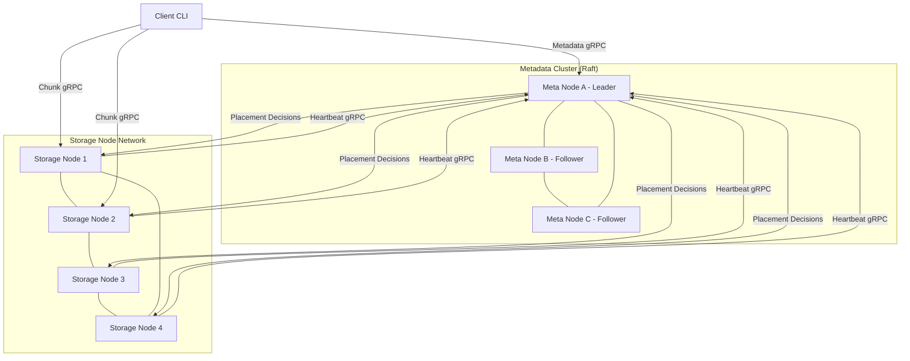
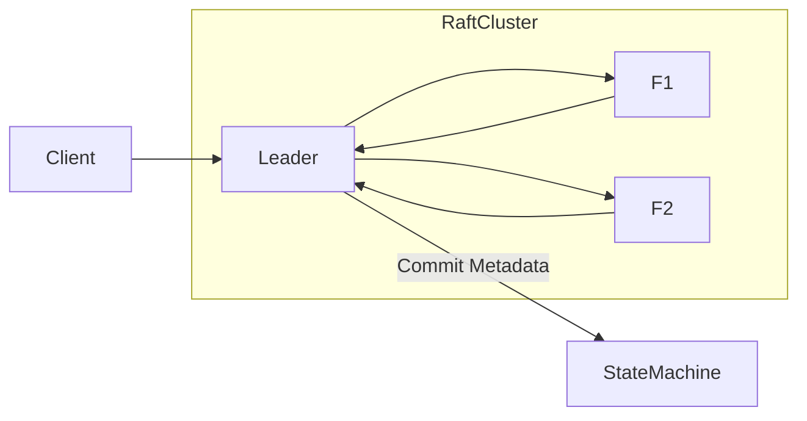
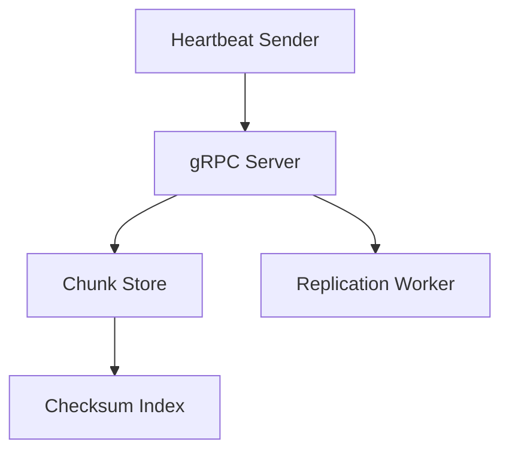
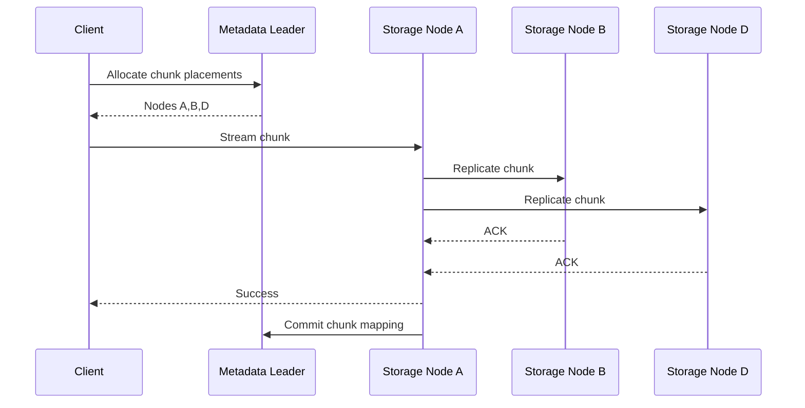
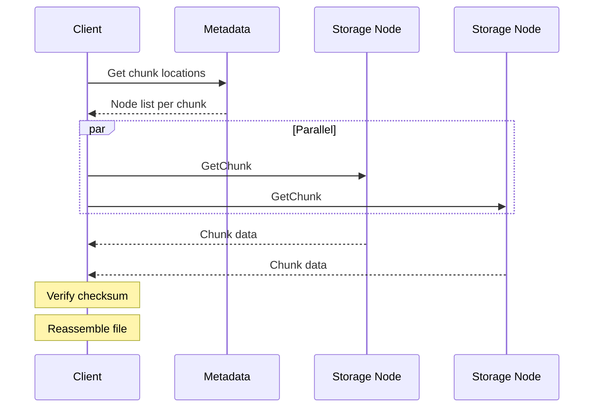
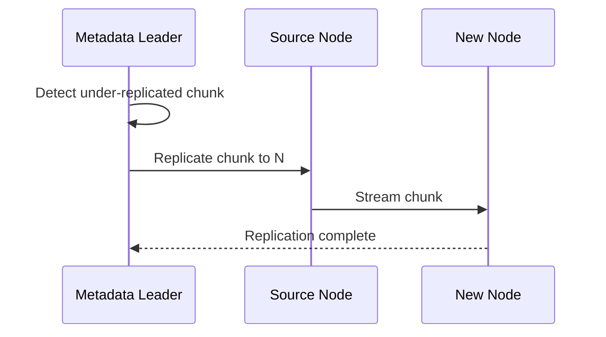
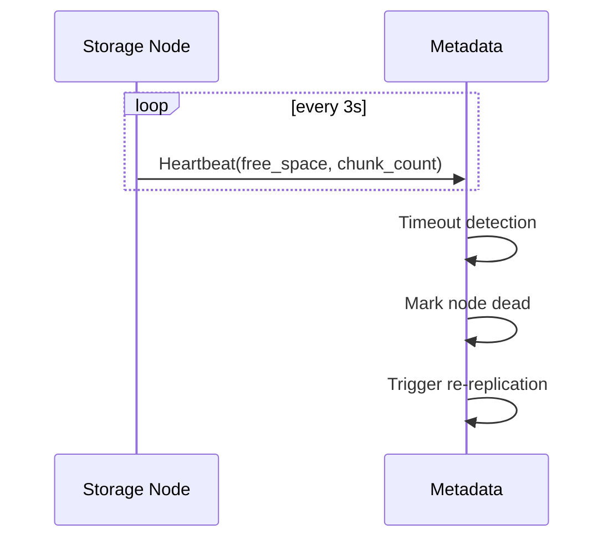

# 📄 Distributed File System in Go

---

# Fault-Tolerant Distributed File System

## Overview

This project implements a fault-tolerant distributed file system with:

- Replicated metadata using Raft consensus
- Peer-to-peer chunk replication between storage nodes
- gRPC-based inter-service communication
- Client-side parallel chunk transfer
- Automatic failure detection and re-replication
- Chunk integrity verification via checksums

The system separates:

- Control Plane → Metadata cluster
- Data Plane → Storage nodes

This architecture is inspired by GFS/HDFS but simplified for academic implementation.

---

# High Level Architecture



---

# Control Plane vs Data Plane

## Control Plane

- Metadata Raft cluster
- File → chunk mapping
- Chunk → node mapping
- Node health tracking
- Replication decisions
- Placement strategy

## Data Plane

- Chunk storage
- Chunk transfer
- P2P replication
- Client downloads
- Checksum validation

---

# Metadata Cluster Architecture



## Metadata Stored

- file_id → chunk_ids
- chunk_id → replica_nodes
- replication_factor
- node_status
- free_space
- version

## Why Raft

- Leader election
- Strong consistency
- Replicated state machine
- No single point of failure

---

# Storage Node Internal Architecture



## Responsibilities

- Store chunks on disk
- Serve chunks to clients
- Stream chunks to peers
- Verify checksums
- Send heartbeat to metadata

---

# gRPC Interfaces

## Metadata Service

- GetChunkLocations(file)
- AllocateChunk(file, index)
- CommitChunk(chunk_id, node)
- Heartbeat(node_status)
- ReportCorruption(chunk_id)

## Storage Node Service

- PutChunk(stream)
- GetChunk(stream)
- ReplicateChunk(target_node)
- VerifyChunk(chunk_id)

---

# File Upload Flow



## Notes

- Client uploads to primary node
- Primary replicates P2P
- Metadata updated only after success
- No write ordering complexity
- Write-once model

---

# File Download Flow



---

# Replication Repair Flow



---

# Heartbeat & Failure Detection



---

# Chunk Layout

- Chunk size: configurable (4–8 MB)
- Chunk ID: SHA256(file_id + index)
- Stored as file on disk
- Checksum stored separately

Directory example:

```
chunks/
  ab12.chunk
  9fd3.chunk
checksums.json
```

---

# Placement Strategy

Initial version:

- choose nodes with most free space
- avoid duplicate replica on same node
- round-robin fallback

Advanced option:

- rack/failure-domain labels

---

# Consistency Model

System uses:

**Write Once — Read Many**

- No concurrent writes
- No distributed locking needed
- Simplifies replication
- Safe for academic DFS

---

# Fault Tolerance

## Metadata Layer

- Raft majority commit
- Leader election
- Log replication

## Storage Layer

- Replication factor = 3
- Automatic repair
- Checksum validation

---

# Differences from GFS

- Simplified write pipeline
- No lease-based write ordering
- No rack-awareness (optional)
- Raft instead of custom master journal

---

# Differences from BitTorrent

- Managed storage nodes
- Consensus metadata
- Guaranteed replication factor
- Persistent storage responsibility
- Controlled placement

---

# Demo Scenario

- Start 3 metadata nodes
- Leader election visible
- Start 4 storage nodes
- Upload file
- Show chunk distribution
- Kill one node
- Auto re-replication triggers
- File still downloadable

---

# Tech Stack

- Go
- gRPC
- Hashicorp Raft
- SHA256 checksums
- Local disk chunk storage

---

# Implementation Plans

[Storage Node Implementation](./Storage%20Node%20Implementation.md)

[Client Implementation](./Client%20Implementation.md)